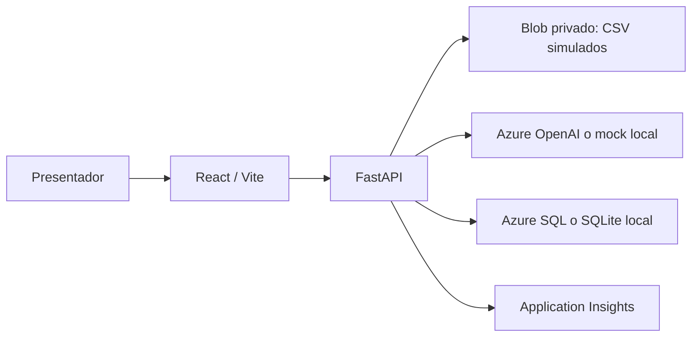

# Arquitectura oficial del Laboratorio 06

Fase 1 prepara el código **solo en local**; el Azure existente todavía no recibe esta versión.

Caso 1: empresa simulada → `kyc_v1` → `scoring_v1` → `explainability_v1` → decisión humana. La referencia académica KYC/score se calcula fuera del proveedor IA, solo para contraste posterior. Cada fase tiene una entrada, contrato estructurado y versión registrada.

Caso 2: queja simulada → clasificación V1/V2 con el **mismo contrato** → predicciones → golden humano cargado **después** de inferir → métricas y errores → borrador `response_v1` para un caso individual → revisión humana. En el flujo normal solo se muestran entradas y predicciones, no golden.

El frontend nunca se conecta directamente a SQL, Blob ni OpenAI. En cloud, App Service usa Managed Identity y RBAC entre servicios. La IP restringida de la demo no equivale a autenticación individual ni a una red privada bancaria.
