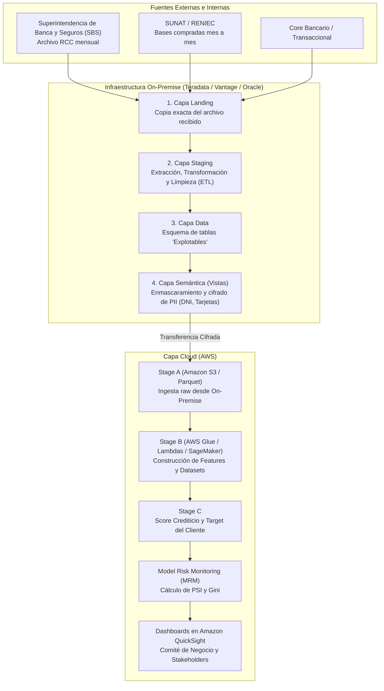

# IT for Banking: Arquitectura de Datos, Modelos en Producción y Gobernanza Bancaria
## Documento Ejecutivo Estructurado y Síntesis de la Sesión Técnica

> **Contexto de la sesión**: Masterclass y sesión técnica impartida por la Líder Técnica de Ingeniería de Datos del área de *Data & Analytics* de **Interbank**, dirigida al equipo del curso/proyecto *IT for Banking*.  
> **Duración original**: 01h 02m 53s  
> **Archivo de origen**: `audio.m4a`  
> **Transcripción base**: Realizada con Whisper `large-v3-turbo` sobre GPU con aceleración CUDA.

---

## Índice
1. [El Problema de Negocio: Degradación Silenciosa de Modelos](#1-el-problema-de-negocio-degradación-silenciosa-de-modelos)
2. [Arquitectura y Ciclo de Vida del Dato: Del On-Premise al Cloud](#2-arquitectura-y-ciclo-de-vida-del-dato-del-on-premise-al-cloud)
3. [Métricas de Monitoreo de Modelos (MRM: Model Risk Monitoring)](#3-métricas-de-monitoreo-de-modelos-mrm-model-risk-monitoring)
4. [Fuentes de Datos del Sistema Financiero Peruano](#4-fuentes-de-datos-del-sistema-financiero-peruano)
5. [Seguridad, Enmascaramiento y Lecciones de Auditoría](#5-seguridad-enmascaramiento-y-lecciones-de-auditoría)
6. [Stack Tecnológico y Herramientas](#6-stack-tecnológico-y-herramientas)
7. [Metodología de Trabajo, Roles y Cultura](#7-metodología-de-trabajo-roles-y-cultura)
8. [Glosario Técnico de Términos Bancarios](#8-glosario-técnico-de-términos-bancarios)

---

## 1. El Problema de Negocio: Degradación Silenciosa de Modelos

En las entidades financieras, la toma de decisiones críticas (otorgamiento de tarjetas de crédito, créditos personales, créditos vehiculares e hipotecarios) descansa sobre **modelos analíticos predictivos de Machine Learning**.

### El riesgo de la "Falla Silenciosa"
- A diferencia de un microservicio o servidor web donde una caída genera un error HTTP 500 o una alerta roja inmediata, **un modelo en producción puede seguir ejecutándose sin errores de software pero arrojando predicciones desfasadas o erróneas**.
- **Causa**: Cambios en el entorno macroeconómico, crisis financieras, inflación, variaciones en el comportamiento de los clientes o corrupción/retraso en la ingesta de variables.
- **Consecuencia**:
  - Otorgar créditos a clientes que han incrementado su riesgo de impago (pérdidas monetarias directas por mora y castigo de cartera).
  - Rechazar clientes solventes (pérdida de cuota de mercado frente a competidores como BCP, BBVA o Scotiabank).

> *"Si el modelo empieza a fallar silenciosamente en el tiempo y nadie lo monitorea, el banco toma decisiones en base a datos irreales del cliente. Esto no solo causa fuga de clientes, sino pérdidas millonarias para la entidad financiera."* `[00:00:25 - 00:01:48]`

---

## 2. Arquitectura y Ciclo de Vida del Dato: Del On-Premise al Cloud

El flujo de información para modelos de riesgo atraviesa un pipeline híbrido altamente controlado que conecta la infraestructura *On-Premise* con la nube pública (*AWS*).



### Detalle de las Capas:

### A. Capa On-Premise (Teradata Vantage / Oracle)
1. **Landing**: Almacena el archivo crudo exactamente como fue entregado por el proveedor o la SBS.
2. **Staging**: Ejecución de procesos ETL. Limpieza de tipos de datos, descarte de registros corruptos y normalización.
3. **Data Layer (Explotables)**: Tablas con modelos de datos estructurados para consumo de ingeniería.
4. **Semántica**: Capa de vistas finales donde se ejecuta la **anonimización/enmascaramiento obligatorio**. Ningún dato identificativo (DNI, nombres, teléfonos, números completos de tarjeta) puede salir hacia la nube.

### B. Capa Cloud (AWS Data Platform)
1. **Stage A**: Zona de aterrizaje en la nube. Almacenamiento optimizado en formato columnar comprimido (**Apache Parquet** en Amazon S3).
2. **Stage B**: Procesamiento y transformación con AWS Glue, AWS Lambda y scripts SQL. Aquí se consolidan las variables maestras del cliente (días de mora, saldo disponible, endeudamiento total, ratios de pago).
3. **Stage C**: Generación de los scores de riesgo y cálculo de variables objetivo (*target*).

---

## 3. Métricas de Monitoreo de Modelos (MRM: Model Risk Monitoring)

El equipo de **Model Risk Monitoring (MRM)** está conformado por perfiles cuantitativos y estadísticos que auditan si el modelo conserva su validez matemática y de negocio.

Se utilizan dos indicadores principales representados en un **sistema de semáforos**:

### A. PSI (Population Stability Index - Estabilidad Poblacional)
Mide si la población de clientes actual difiere significativamente de la población utilizada durante el entrenamiento original del modelo.

| Rango de PSI | Color Semáforo | Estado | Acción Requerida |
| :--- | :---: | :--- | :--- |
| **< 10%** | 🟢 Verde | **Estable** | El modelo continúa en producción con normalidad. |
| **10% - 15%** | 🟡 Amarillo | **Alerta / Vigilancia** | Investigar origen: posible cambio de variables, datos duplicados o cambios de tendencia. |
| **> 15%** | 🔴 Rojo | **Inestable / Caída** | El modelo no representa a la población. El Data Scientist debe intervenir, reentrenar o ajustar la lógica. |

### B. Coeficiente Gini (Capacidad Predictiva / Performance)
Evalúa si el modelo mantiene su capacidad para discriminar eficazmente entre un cliente con buen comportamiento de pago y un cliente con alta probabilidad de mora (*default*).

- **Verde**: El ordenamiento de riesgo se mantiene conforme a las pruebas de validación.
- **Amarillo**: Pérdida paulatina de poder discriminante.
- **Rojo**: El modelo perdió capacidad predictiva. El negocio y el comité deciden en sesión ejecutiva si se reentrena o se da de baja definitiva.

---

## 4. Fuentes de Datos del Sistema Financiero Peruano

Para evaluar la capacidad de pago y riesgo crediticio de un cliente, los bancos en el Perú integran múltiples fuentes:

1. **RCC (Reporte de Consistencia Crediticia / SBS)**:
   - **Naturaleza**: Fuente central del sistema financiero peruano.
   - **Contenido**: Consolida el historial de créditos, saldos, líneas activas y calificaciones de riesgo de cada ciudadano en todos los bancos (Interbank, BCP, BBVA, Scotiabank, cajas municipales, financieras).
   - **Periodicidad y Desfase**: Llega mensualmente (alrededor de los días 20 al 22 de cada mes) con **1 mes de atraso**.
   - *Implicancia práctica*: Si un cliente solicita un préstamo en un banco hoy y la semana siguiente solicita otro en una entidad distinta, el segundo banco no verá el préstamo reciente en el RCC hasta el siguiente reporte mensual consolidado por la SBS.
2. **SUNAT**: Bases de datos adquiridas para validar actividad económica, RUC, ingresos declarados y regularidad tributaria.
3. **RENIEC**: Actualización de padrón ciudadano, estado civil, defunciones y verificación de identidad.
4. **Buroes Privados (Infocorp / Equifax, Experian)**: Historial crediticio rápido, alertas de cobranza dudosa y protestos.

---

## 5. Seguridad, Enmascaramiento y Lecciones de Auditoría

El sector bancario opera bajo un marco estricto de regulación y cumplimiento legal (SBS, Ley de Protección de Datos Personales, Auditoría SOX e INDECOPI).

### Aislamiento Estricto entre Empresas del Mismo Grupo
- **Regla**: Aunque entidades como *Interbank* e *Interseguro* pertenezcan al mismo grupo empresarial (*Intercorp*), **no pueden compartir bases de datos de clientes** debido a las leyes de protección de datos y secreto bancario.
- Los asesores de seguros deben prospectar sus propios canales; la ingeniería bancaria no puede exportar listas hacia empresas hermanas sin infringir la ley.

### Enmascaramiento y PII (Personally Identifiable Information)
- Los datos como DNI, teléfonos, correos y tarjetas de crédito se tokenizan o enmascaran en la capa semántica on-premise antes de llegar a la nube.
- En la nube, los análisis se efectúan mediante un identificador o hash unívoco por cliente.

### Lecciones del Caso de Filtración Externa
Durante la sesión se abordó el incidente público de seguridad sufrido por Interbank:
1. **Origen del incidente**: Se determinó mediante auditoría forense que la filtración se originó a través de **un proveedor de servicios tercerizado** externo (credenciales/accesos comprometidos), y no por una falla intrínseca de los servicios de AWS.
2. **Medidas correctivas aplicadas en el banco**:
   - Reducción drástica y eliminación de proveedores externos en capas críticas de datos.
   - Restricciones severas en equipos corporativos: Bloqueo de servicios web personales (Gmail, ChatGPT público, redes sociales, YouTube).
   - Políticas de *"Zero Data Leak"*: Prohibición de descarga o extracción de archivos, con auditorías automáticas incluso ante el vaciado de papelera de reciclaje.
   - Notificación y compensación regulada por INDECOPI y la SBS.

---

## 6. Stack Tecnológico y Herramientas

| Categoría | Herramientas y Servicios Utilizados | Función dentro del Banco |
| :--- | :--- | :--- |
| **Bases de Datos On-Premise** | **Teradata**, **Teradata Vantage**, Oracle *(en retiro)* | Almacenamiento masivo de históricos y ETL inicial de fuentes maestras. |
| **Cloud Storage** | **Amazon S3** (Formato Parquet) | *Data Lakehouse* en capas (Stage A, B, C). |
| **Procesamiento y ETL Cloud** | **AWS Glue**, **AWS Lambda**, Scripts SQL | Ingesta automática, cruce de variables y cálculo de scores. |
| **Modelado y Machine Learning** | **Amazon SageMaker**, Python (Notebooks) | Entrenamiento, prototipado y automatización de pipelines de ML. |
| **Monitoreo e Infraestructura** | **Amazon CloudWatch** | Trazabilidad de logs, métricas de rendimiento y alarmas de falla. |
| **Mensajería y Alertas** | **Amazon SES**, **Amazon SNS** | Envío de correos automáticos de estado, éxito o fallo crítico de procesos. |
| **Business Intelligence** | **Amazon QuickSight** | Dashboards ejecutivos de estabilidad (PSI) y performance (Gini). |
| **Nube Secundaria** | **Microsoft Azure** | Utilizada para ciertas aplicaciones satélite (ej. plataforma e-commerce *Shopstar*). |
| **IA Generativa y Asistentes** | **Claude / Anthropic**, GitHub Copilot | Asistencia paulatina a ingenieros para optimizar código y reducir carga operativa. |

---

## 7. Metodología de Trabajo, Roles y Cultura

### Metodología de Gestión
- **Scrum / Agile**: Planificación por sprints y seguimiento de tareas en **Jira**.
- **Priorización de Backlog**: Las tareas son priorizadas por el **Product Owner (PO)** en base a los **KRs (Key Results)** trimestrales del equipo de negocio.
- **Operaciones 24/7 y Procesos Críticos**:
  - Los procesos masivos de riesgo y scoring se ejecutan durante la madrugada.
  - Cuentan con políticas de reintento automático (*retry policies*).
  - Si un proceso crítico falla y agota sus reintentos, el equipo de operaciones escala de inmediato llamando al Líder Técnico.

### Escala de Carrera en Ingeniería de Datos (Interbank)
```
Nivel 5 (Junior / Practicante)
   └── Nivel 4 (Mid / Ejecución autónoma)
          └── Nivel 3 (Senior / Diseño de arquitecturas On-Prem y Cloud)
                 ├── Rama de Gestión: Data Team Leader (Gestión de equipos humanos)
                 └── Rama Técnica: Staff Data Engineer / AI Expert (Referente técnico cross)
```

---

## 8. Glosario Técnico de Términos Bancarios

- **RCC (Reporte de Consistencia Crediticia)**: Base de datos oficial de la SBS que unifica el comportamiento crediticio de todos los deudores en el sistema financiero peruano.
- **SBS**: Superintendencia de Banca, Seguros y AFP (ente regulador del sistema financiero en el Perú).
- **MRM (Model Risk Monitoring / Management)**: Área encargada de gobernar, validar y vigilar la estabilidad y precisión de los modelos estadísticos y de IA.
- **Target**: Variable dependiente que el modelo predice (por ejemplo: `1` si el cliente incurre en mora mayor a 60 días dentro de los próximos 12 meses, `0` en caso contrario).
- **PSI (Population Stability Index)**: Métrica que mide el cambio en la distribución de una variable o score entre dos periodos temporales.
- **Gini**: Indicador de capacidad de separación entre clases positivas y negativas en scoring crediticio.
- **FinOps**: Disciplina de gestión financiera que optimiza el consumo de recursos de computación y almacenamiento en la nube.
